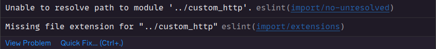

# React Native Setup

## How to reproduce this template

The template of this repository can be reproduced as described in the following steps.

## Initial configuration

Execute the command bellow to install [Yarn](https://yarnpkg.com/), the alternative package manager over [npm](https://www.npmjs.com/).

```bash
npm install -g yarn
```

The easiest way to get started is to initialize your new project using [Expo CLI](https://docs.expo.dev/workflow/expo-cli/).

```bash
npx create-expo-app -t expo-template-blank-typescript
```

## ESLint

ESLint is a code analysis tool to identify problems and bad practices in JavaScript and TypeScript code.

To install this package, run the following command:

```bash
yarn create @eslint/config
```

The next lines contain a set of questions and answers that reproduce the configuration applied in this repository.

<hr>

**How would you like to use ESLint?**

> To check syntax, find problems, and enforce code style

**What type of modules does your project use?**

> JavaScript modules (import/export)

**Which framework does your project use?**

> React

**Does your project use TypeScript?**

> Yes

**Where does your code run?**

> Browser

> Node

**How would you like to define a style for your project?**

> Answer questions about your style

**Which style guide do you want to follow?**

> Answer questions about your style

**What format do you want your config file to be in?**

> JSON

**What style of indentation do you use?**

> Spaces

**What quotes do you use for strings?**

> Double

**What line endings do you use?**

> Unix

**Do you require semicolons?**

> Yes

**Would you like to install them now with npm?**

> Yes

**Which package manager do you want to use?**

> Yarn

After completing the installation, the `.eslintrc.json` file will be created inside root folder

```json
{
  "env": {
    "es2021": true,
    "node": true
  },
  "extends": [
    "eslint:recommended",
    "plugin:react/recommended",
    "plugin:@typescript-eslint/recommended"
  ],
  "overrides": [],
  "parser": "@typescript-eslint/parser",
  "parserOptions": {
    "ecmaVersion": "latest",
    "sourceType": "module"
  },
  "plugins": ["react", "@typescript-eslint"],
  "rules": {
    "indent": ["error", 4],
    "linebreak-style": ["error", "unix"],
    "quotes": ["error", "double"],
    "semi": ["error", "always"]
  }
}
```

and some dev dependencies will be added in `package.json` file

```diff
  "devDependencies": {
    "@babel/core": "^7.12.9",
    "@types/react": "~18.0.14",
    "@types/react-native": "~0.70.6",
+   "@typescript-eslint/eslint-plugin": "^5.45.0",
+   "@typescript-eslint/parser": "^5.45.0",
+   "eslint": "^8.29.0",
+   "eslint-plugin-react": "^7.31.11",
    "typescript": "^4.6.3"
  },
```

> If you are using [VSCode](https://code.visualstudio.com/) is necessary install the [ESLint Plugin](https://marketplace.visualstudio.com/items?itemName=dbaeumer.vscode-eslint).

The rules below may be removed. Don't worry, they will be configured in the next steps with prettier.

```diff
{

  "rules": {
-    "indent": ["error", 4],
-    "linebreak-style": ["error", "unix"],
-    "quotes": ["error", "double"],
-    "semi": ["error", "always"]
  }
}
```

Put this line in the `eslintrc.json` file so that the `babel.config.ts` file is not parsed:

```diff
{
+  "ignorePatterns": ["babel.config.js"]
}
```

To avoid import erros

<br>

[...] install the following package

```bash
yarn add -D eslint-import-resolver-typescript
```

[...] and apply these configurations in the `eslintrc.json` file:

```diff
{
  "rules": {
    "prettier/prettier": "error",
    "react/react-in-jsx-scope": "off",
    "react/jsx-filename-extension": [
      1,
      { "extensions": [".js", ".jsx", ".ts", ".tsx"] }
    ],
    "no-use-before-define": "off",
    "import/prefer-default-export": "off",
+   "import/extensions": [
+     "error",
+     "ignorePackages",
+     { "ts": "never", "tsx": "never" }
+   ]
  },
+ "settings": {
+   "import/resolver": {
+     "typescript": {}
+   }
+ }
}
```

## ESLint - Airbnb Configuration

Airbnb created the most popular style guide for eslint, it is widely used in React projects because it avoids accidental bugs, bad practices, and keeps your code clean and standardized. This means the code will be easier to maintain over time.

Install the required packages with the following command:

```bash
npx install-peerdeps --dev eslint-config-airbnb
```

The following dependencies will be automatically added to the `package.json` file:

```diff
{
  "devDependencies": {
    "@babel/core": "^7.12.9",
    "@types/react": "~18.0.14",
    "@types/react-native": "~0.70.6",
    "@typescript-eslint/eslint-plugin": "^5.45.0",
    "@typescript-eslint/parser": "^5.45.0",
    "eslint": "^8.2.0",
+   "eslint-config-airbnb": "19.0.4",
+   "eslint-plugin-import": "^2.25.3",
+   "eslint-plugin-jsx-a11y": "^6.5.1",
    "eslint-plugin-react": "^7.28.0",
+   "eslint-plugin-react-hooks": "^4.3.0",
    "typescript": "^4.6.3"
  },
}
```

Install [eslint-config-airbnb-typescript](https://github.com/iamturns/eslint-config-airbnb-typescript) to add typescript support:

```bash
yarn add -D eslint-config-airbnb-typescript
```

The next step is to add the following lines in the `.eslintrc` file:

```diff
{
  "extends": [
    "eslint:recommended",
    "plugin:react/recommended",
    "plugin:@typescript-eslint/recommended",
+   "airbnb",
+   "airbnb/hooks",
+   "airbnb-typescript"
  ],
  "parserOptions": {
    "ecmaVersion": "latest",
    "sourceType": "module",
+   "project": "./tsconfig.json"
  },
}
```


## ESLint - Additional Rules

Edit your `.eslintrc.json` file as shown below:

```diff
{
  "rules": {
+    "react/react-in-jsx-scope": "off",
+    "react/jsx-filename-extension": [
+      1,
+      { "extensions": [".js", ".jsx", ".ts", ".tsx"] }
+    ],
+    "no-use-before-define": "off",
+    "import/prefer-default-export" "off"
  }
}
```

- `react/react-in-jsx-scope`: currently it's no longer necessary to import React in jsx/tsx scope, so disable this rule to avoid unnecessary imports.
- `react/jsx-filename-extension`: this configuration contains a list of extensions used for react files.
- `no-use-before-define`: disabling this rule will allow the use of variables and functions before they are declared.
- `import/prefer-default-export`: disabling this rule makes the use of default export optional.

To finish eslint configuration add the following lines in your `package.json` file:

```diff
{
  "scripts": {
    "start": "expo start",
    "android": "expo start --android",
    "ios": "expo start --ios",
    "web": "expo start --web",
+   "lint": "eslint . --ext .ts --ext .tsx",
+   "lint:fix": "yarn lint --fix"
  },
}
```

Now you can run `yarn lint` to find problems in your code and run `yarn lint:fix` to fix the problems found.

## Prettier

The prettier is a text formatter for javascript and typescript files.

To install prettier in your project run the following command:

```bash
yarn add prettier -D
```

To enable prettier rules into ESLint rules install the following dependency:

```bash
yarn add eslint-plugin-prettier -D
```

Then, in `.eslintrc.json` file, put these lines:

```diff
{
  "plugins": [
    "react",
    "@typescript-eslint",
+   "prettier"
  ],
  "rules": {
+   "prettier/prettier": "error",
    "react/react-in-jsx-scope": "off",
    "react/jsx-filename-extension": [
      1,
      { "extensions": [".js", ".jsx", ".ts", ".tsx"] }
    ],
    "no-use-before-define": "off"
  }
}
```

> For more details see the [eslint-plugin-prettier](https://github.com/prettier/eslint-plugin-prettier) repository.

To prevent the prettier and eslint rules from conflicting, it's necessary to install the following plugin:

```bash
yarn add eslint-config-prettier -D
```

Then, in `.eslintrc.json` file, put these lines:

```diff
{
  "extends": [
    "eslint:recommended",
    "plugin:react/recommended",
    "plugin:@typescript-eslint/recommended",
    "airbnb",
    "airbnb/hooks",
+   "plugin:prettier/recommended"
  ]
}
```

> For more details see the [eslint-config-prettier](https://github.com/prettier/eslint-config-prettier) repository.

> If you are using [VSCode](https://code.visualstudio.com/), is necessary install the [Prettier Plugin](https://marketplace.visualstudio.com/items?itemName=esbenp.prettier-vscode).

The next step is create a `.prettierrc.json` file inside root folder:

```json
{
  "semi": false,
  "trailingComma": "all",
  "singleQuote": true,
  "printWidth": 85,
  "tabWidth": 2
}
```

> Change the settings according to your need. See the [prettier options](https://prettier.io/docs/en/options.html) for more details.

# React Native Dotenv

It's common to change the behavior of applications according to the environment.

In Node.js we can create [.env](https://nodejs.dev/en/learn/how-to-read-environment-variables-from-nodejs/) file to define the configuration properties. To make it work in React Native we must install the [react-native-dotenv](https://github.com/goatandsheep/react-native-dotenv) package.

```bash
yarn add -D react-native-dotenv @types/react-native-dotenv
```

After installation, update `babel.config.js` file as shown below:

```diff
module.exports = function (api) {
  api.cache(true);
  return {
    presets: ["babel-preset-expo"],
+   plugins: [["module:react-native-dotenv"]],
  };
};
```

To import environment variables using an alias, create a file called `env.d.ts` inside root folder with the following content:

```typescript
declare module "@env" {
  export const NODE_ENV: string;
}
```

To avoid eslint errors add the following rule in the `eslintrc.json` file:

```diff
{
  "rules": {
    ...[other rules]
+   "import/no-unresolved": [2, { "ignore": ["@env"] }]
  },
}
```

Now you can import env variables as shown below:

```typescript
import { NODE_ENV } from "@env";
```

> **Note**
> always remember to update the `env.d.ts` file when creating new environment variables.

## Mirage JS

> "[Mirage JS](https://miragejs.com/) is an API mocking library that lets you build, test and share a complete working JavaScript application without having to rely on any backend services."

Run the following command to install the package:

```bash
yarn add --dev miragejs
```

Create file `src/mocks/mock_server.ts` with the following content:

```typescript
import { createServer } from "miragejs";
import { NODE_ENV } from "@env";

if (NODE_ENV === "development") {
  window.server = createServer({
    routes() {
      // Mock of your routes here
    },
  });
}
```

The previously created file must be modified with mock of your routes. See [official documentation](https://miragejs.com/quickstarts/react-native/development/) for more details.

Create file `src/global.d.ts` to register the type of **window.server** global property.

```typescript
import { Registry, Server } from "miragejs";
import { AnyFactories, AnyModels } from "miragejs/-types";

export {};

declare global {
  interface Window {
    server: Server<Registry<AnyModels, AnyFactories>>;
  }
}
```

Modify the `eslintrc.json` file to avoid import errors.

```diff
{
  "rules": {
    ...[other rules]
+   "import/no-unresolved": [2, { "ignore": ["@env", "miragejs"] }],
+   "import/no-extraneous-dependencies": [
+     "error",
+     { "devDependencies": ["**/mocks/*.ts", "**/global.d.ts"] }
+   ]
  },
}
```

Now, you can import `./src/mocks/mock_server` into the `App.tsx` file to make Mirage JS work.

```diff
import { StatusBar } from "expo-status-bar";
import { StyleSheet, Text, View } from "react-native";
import { NODE_ENV } from "@env";

+import "./src/mocks/mock_server";
```